# MANUAL PENGGUNAAN MONITORING SERVER JTI POLINEMA

Sistem Monitoring Server JTI di Politeknik Negeri Malang menggunakan [Prometheus](https://prometheus.io/) sebagai sumber data dan [Grafana](http://grafana.org/) untuk visualisasi.
## OpenVPN
- Pertama-tama, pastikan PC sudah terhubung ke jaringan Wi-Fi "JTI-POLINEMA".

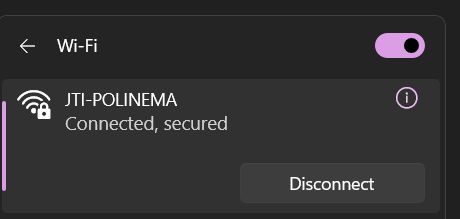

- Buka OpenVPN.

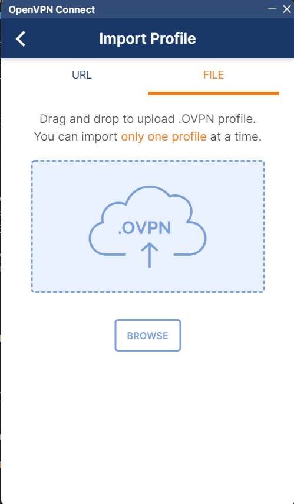

- Unggah file konfigurasi "monsev", lalu tambahkan username, password, dan Secretkey berikut: 
``` bash
Username : mts
Password : yudha
Secretkey: jtifast!
``` 
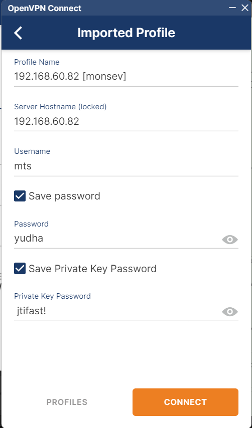

- Klik tombol Connect. Setelah langkah-langkah berhasil, akan muncul tampilan berikut:

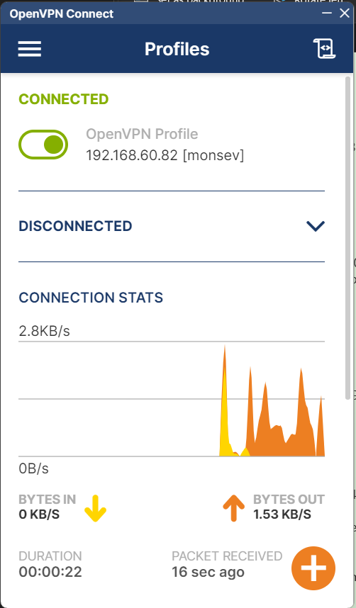
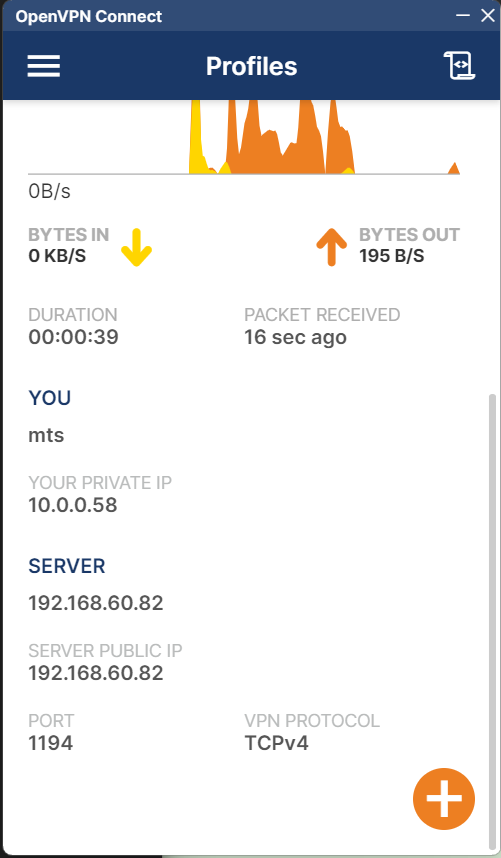

- Setelah terhubung ke OpenVPN, buka CMD dan tambahkan kode berikut:
``` bash
route ADD 10.0.0.32 MASK 255.255.255.240 10.0.0.49
```
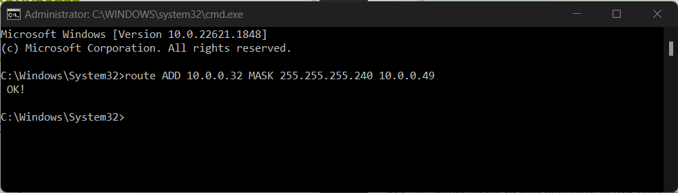

- Setelah semuanya berhasil, coba uji ping ke IP server.

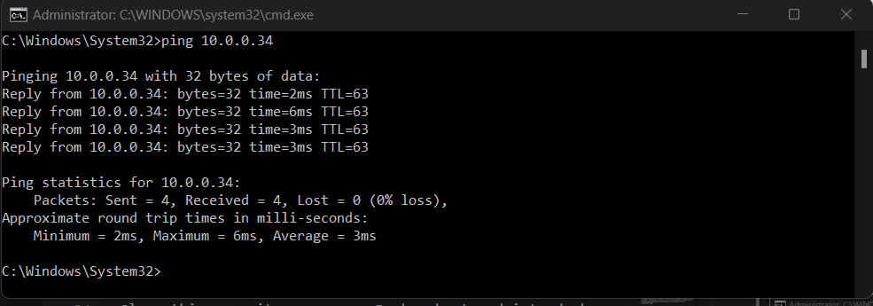


## GRAFANA

- Untuk mengakses Grafana pada http://10.0.0.34:3000, halaman login akan muncul seperti berikut:
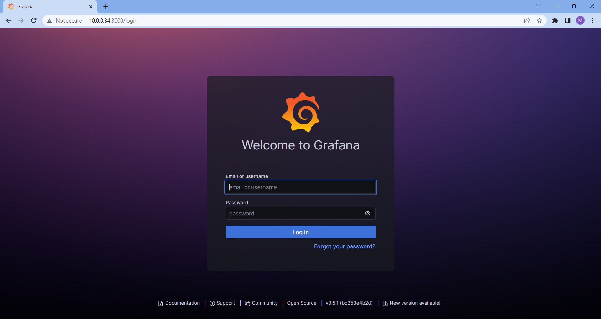

- Masuk dengan akun Grafana default:
``` bash
Username : admin
Password : admin
```
- Setelah berhasil masuk, Anda akan diarahkan ke halaman utama. 
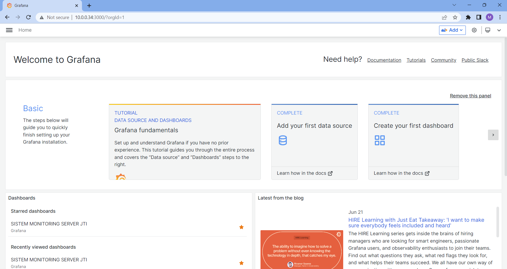

- Pada halaman utama Grafana, pilih "SISTEM PEMANTAUAN SERVER JTI" dalam menu Dashboard, dan tampilan akan muncul seperti berikut: 
- All Panel Gauge CPU, Ram dan Disk
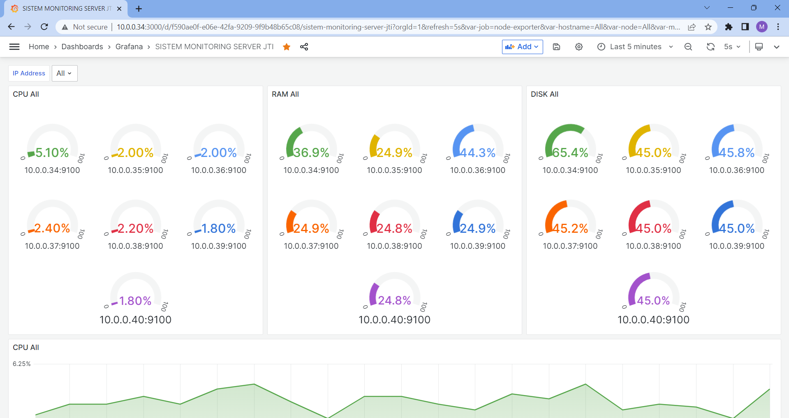
- All Ram
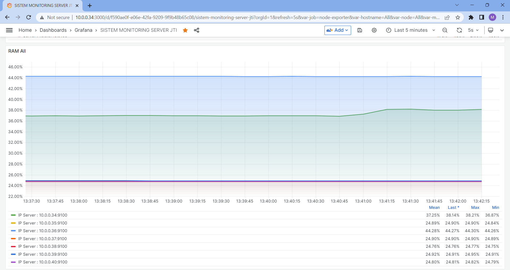
- All Disk
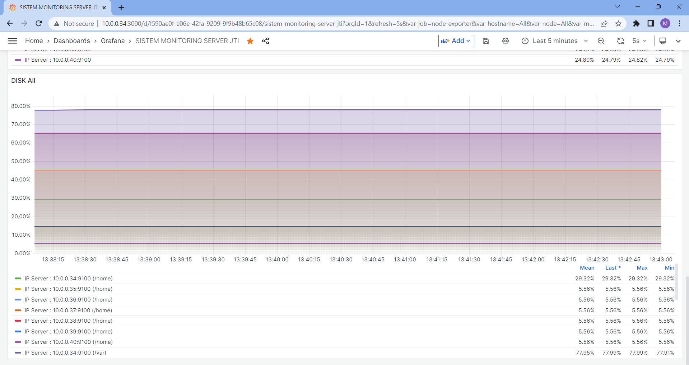

- Pada halaman utama Sistem Pemantauan Server JTI, terdapat label Filter Alamat IP.

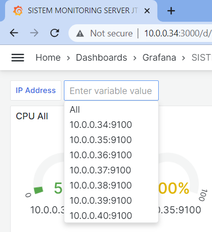

Di dalam label ini terdapat daftar server yang dimonitor sehingga Anda dapat menampilkan hanya satu server. Sebagai contoh, mari pilih IP Server: 10.0.0.34.
- Filter Panel Grafik CPU, Ram dan Disk
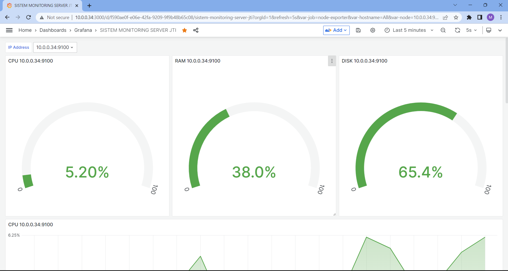
- Filter CPU 
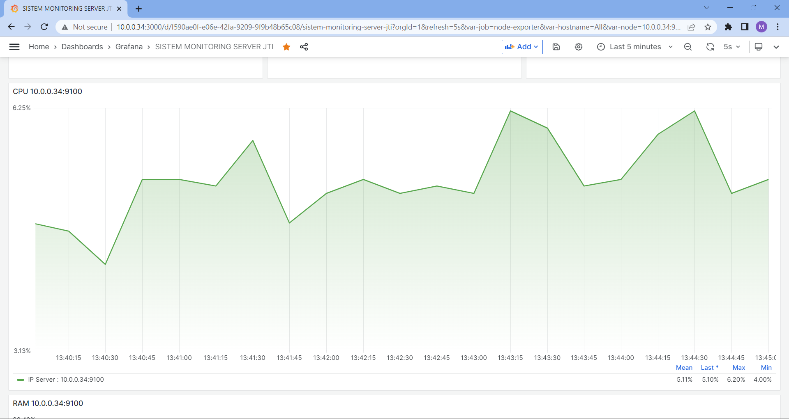
- Filter Ram 
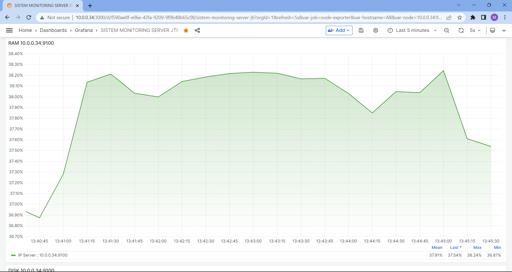
- Filter Disk 
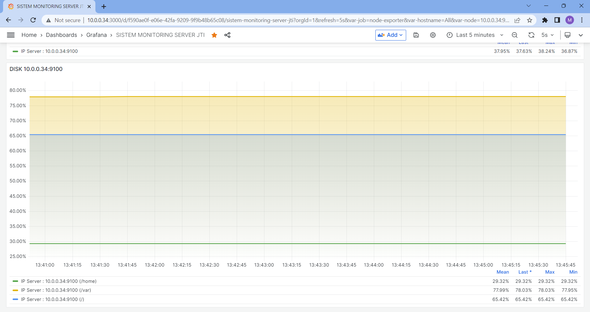

- Selain itu, pada halaman Dashboard terdapat fitur Refresh Dashboard yang memungkinkan Anda untuk secara otomatis memperbarui dashboard mulai dari setiap detik hingga setiap hari.
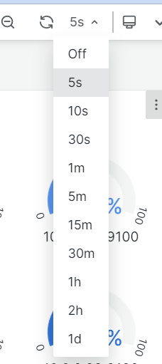